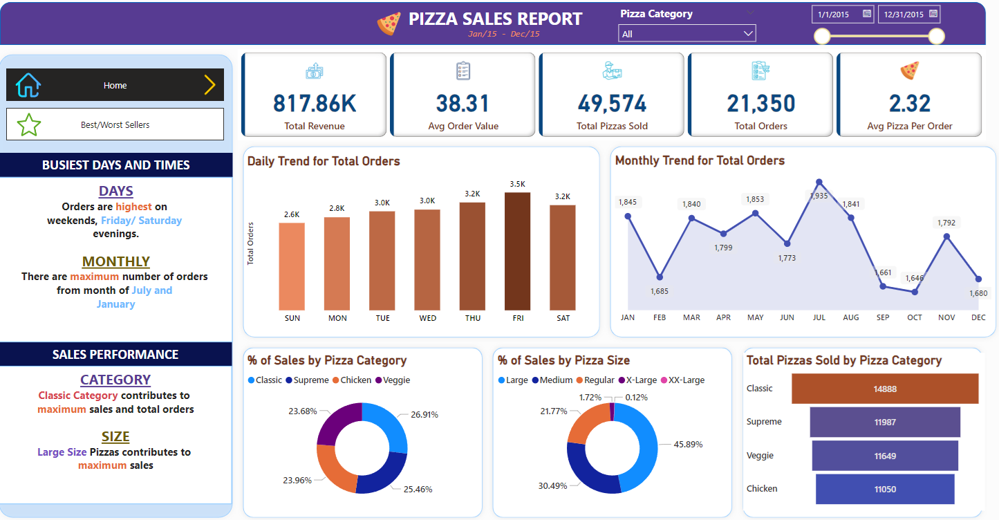

# Projects in Microsoft Power BI

---

### Table of Contents

- [Projects](#projects)
- [License](#license)
- [Author Info](#author-info)

---

## Projects

This repository contains my data analysis projects which I have worked using Microsoft Power BI.

### Coffee Sales Dashboard

#### Report Link: [Link](https://app.powerbi.com/view?r=eyJrIjoiN2QzNTc4ZmYtZTdlYy00NTcyLWJhYzUtNTRkNTg0OGJiYmMwIiwidCI6Ijk3ODIwYmJjLTE3ZjUtNGRmYy1iNjlkLTY5ZWJjOTRhYzZiZiJ9)

#### Objective

- **Primary KPI's**
    - Total Sales Analysis
    - Total Order Analysis
    - Total Quantity Sold Analysis

#### Key Tasks

- Load dataset into Power BI. The data used for this project is [here](coffee-sales/CoffeeShopSales.xlsx)
- Open Power Query Editor and check **Column Quality, Distribution and Profile** to check for errors, duplicates and empty values
- Create a Date table to be able to date related calculations.
- Define Measures to calculate the required KPI's.
- Design appropriate visuals to display the necessary information in the report.

#### Outcome

You can access the Power BI Report [here](coffee-sales/CoffeeSalesReport.pbix)

### HR Analytics Dashboard

#### Report Link: [Link](https://app.powerbi.com/view?r=eyJrIjoiNmNjMGYyNTAtOWE5YS00MmJlLTkwNGYtNTAyYWM3YjBiYmFmIiwidCI6Ijk3ODIwYmJjLTE3ZjUtNGRmYy1iNjlkLTY5ZWJjOTRhYzZiZiJ9)

#### Objective

- **Primary KPI's**
    - Total Employees
    - Employee Gender demographics
    - Employees due for Promotion
    - Employees due for retreachment
    - Job Satisfaction Analysis
    - Employee Analysis by department

#### Key Tasks

- Load dataset into Power BI. The data used for this project is [here](hr-data-analysis/HRAnalyticsData.csv) and [here](hr-data-analysis/HREmployeeData.csv).
- Open Power Query Editor and check **Column Quality, Distribution and Profile** to check for errors, duplicates and empty values
- Create a Date table to be able to date related calculations.
- Define Measures to calculate the required KPI's.
- Design appropriate visuals to display the necessary information in the report.

#### Outcome

You can access the Power BI Report [here](hr-data-analysis/HRAnalyticsReport.pbix)

### Pizza Sales Dashboard

#### Report Link: [Link](https://app.powerbi.com/view?r=eyJrIjoiM2I1ODIyYzMtNmM2Ny00Y2QyLWE3YTMtZjc5NWZkMjE2ZmIyIiwidCI6Ijk3ODIwYmJjLTE3ZjUtNGRmYy1iNjlkLTY5ZWJjOTRhYzZiZiJ9&embedImagePlaceholder=true)

#### Objective

- **Primary KPI's**
    - Total Revenue
    - Average Order Value
    - Total Pizzas Sold
    - Total Orders
    - Average Pizzas Per Order

#### Key Tasks

- Load dataset into Power BI. The data used for this project is [here](pizza-sales/pizza_sales_excel_file.xlsx)
- Open Power Query Editor and check **Column Quality, Distribution and Profile** to check for errors, duplicates and empty values
- Create a Date table to be able to date related calculations.
- Define Measures to calculate the required KPI's.
- Design appropriate visuals to display the necessary information in the report.

#### Outcome

You can access the Power BI Report [here](pizza-sales/PizzaSalesReport.pbix)

### Grocery Sales Dashboard

#### Report Link: [Link](https://app.powerbi.com/view?r=eyJrIjoiM2I3YTM5MGItMjdkMi00NTg4LWE3OTUtYmY0OGI1MWVkMzQyIiwidCI6Ijk3ODIwYmJjLTE3ZjUtNGRmYy1iNjlkLTY5ZWJjOTRhYzZiZiJ9)

#### Objective

- **Primary KPI's**
    - Total Sales of Items
    - Average Sales of Items
    - Number of Items
    - Average Rating of Items
    - Analyze the impact of Fat Content, Item Type, Outlet Establishment on Total Sales

#### Key Tasks

- Load dataset into Power BI. The data used for this project is [here](grocery-sales/BlinkITGroceryData.xlsx)
- Open Power Query Editor and check **Column Quality, Distribution and Profile** to check for errors, duplicates and empty values
- Create a Date table to be able to date related calculations.
- Define Measures to calculate the required KPI's.
- Design appropriate visuals to display the necessary information in the report.

#### Outcome

You can access the Power BI Report [here](grocery-sales/GrocerySalesReport.pbix)

### Sales Dashboard

#### Report Link: [Link](https://app.powerbi.com/view?r=eyJrIjoiZWZmYzZkYjYtNzQ4OS00N2EyLWFkM2UtOGFmZDgxZDlmOGEwIiwidCI6Ijk3ODIwYmJjLTE3ZjUtNGRmYy1iNjlkLTY5ZWJjOTRhYzZiZiJ9)

#### Objective

- **Primary KPI's**
    - Display Sales, Profit, Quantity as per the selected year filter
    - Show previous year Sales based on selected year
    - Create a sparkline for monthly data analysis, including an average line for better trend analysis
    - Analyze all data based on Region, State/ Province, and Country

#### Key Tasks

- Load dataset into Power BI. The data used for this project is [here](sales-overview/SalesOverviewData.xlsx)
- Open Power Query Editor and check **Column Quality, Distribution and Profile** to check for errors, duplicates and empty values
- Create a Date table to be able to date related calculations.
- Define Measures to calculate the required KPI's.
- Design appropriate visuals to display the necessary information in the report.

#### Outcome

You can access the Power BI Report [here](sales-overview/SalesOverview.pbix)

[Back to the Top](#projects-in-microsoft-power-bi)

---

## License

MIT License

Copyright (c) [2024] [Prasanna Sriram]

Permission is hereby granted, free of charge, to any person obtaining a copy
of this software and associated documentation files (the "Software"), to deal
in the Software without restriction, including without limitation the rights
to use, copy, modify, merge, publish, distribute, sublicense, and/or sell
copies of the Software, and to permit persons to whom the Software is
furnished to do so, subject to the following conditions:

The above copyright notice and this permission notice shall be included in all
copies or substantial portions of the Software.

THE SOFTWARE IS PROVIDED "AS IS", WITHOUT WARRANTY OF ANY KIND, EXPRESS OR
IMPLIED, INCLUDING BUT NOT LIMITED TO THE WARRANTIES OF MERCHANTABILITY,
FITNESS FOR A PARTICULAR PURPOSE AND NONINFRINGEMENT. IN NO EVENT SHALL THE
AUTHORS OR COPYRIGHT HOLDERS BE LIABLE FOR ANY CLAIM, DAMAGES OR OTHER
LIABILITY, WHETHER IN AN ACTION OF CONTRACT, TORT OR OTHERWISE, ARISING FROM,
OUT OF OR IN CONNECTION WITH THE SOFTWARE OR THE USE OR OTHER DEALINGS IN THE
SOFTWARE.

[Back to the Top](#projects-in-microsoft-power-bi)

---

## Author Info

- Github - [pras306](https://github.com/pras306)
- LinkedIn - [Prasanna Sriram](https://www.linkedin.com/in/prasanna-sriram/)

[Back to the Top](#projects-in-microsoft-power-bi)