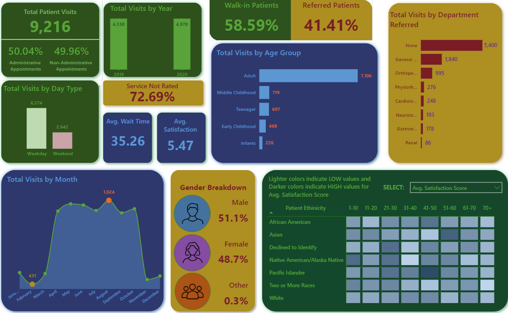

# Healthcare Analysis

---

### Table of Contents

- [Objective](#objective)
- [Technologies](#technologies)
- [Project Files](#project-files)
- [Project Outcome](#project-outcome)
- [License](#license)
- [Author Info](#author-info)

---

## Objective

- **Primary KPI's**
    - Evaluate the average waiting of patients
    - Patient visits on a monthly basis
    - Total visits by department referrals
    - Breakdown of patient visits by age group
    - Determine average satisfaction by different age groups and patient's ethnicity
    - Determine average wait times by different age groups and patient's ethnicity

[Back to the Top](#healthcare-analysis)

---

## Technologies

- Microsoft Power BI

[Back to the Top](#healthcare-analysis)

---

## Project Files

The following are the files in this project.

- [Hospital Patient Data](data/HospitalER.csv)
- [Microsoft Power BI Report](HealthcareReport.pbix)

#### Key Tasks

- Load dataset into Power BI. The data used for this project is [here](data/HospitalER.csv)
- Open Power Query Editor and check **Column Quality, Distribution and Profile** to check for errors, duplicates and empty values
- Create a Date table to be able to date related calculations.
- Define Measures to calculate the required KPI's.
- Design appropriate visuals to display the necessary information in the report.

[Back to the Top](#healthcare-analysis)

---

## Project Outcome

You can access the Power BI Report [here](HealthcareReport.pbix)

The report is also published [here](https://app.powerbi.com/view?r=eyJrIjoiNWZlNGM4YjQtYzZiMi00MTc1LThlMjItMzJlZTQ0YWJkNWIxIiwidCI6Ijk3ODIwYmJjLTE3ZjUtNGRmYy1iNjlkLTY5ZWJjOTRhYzZiZiJ9)

[Back to the Top](#healthcare-analysis)

---

## License

MIT License

Copyright (c) [2024] [Prasanna Sriram]

Permission is hereby granted, free of charge, to any person obtaining a copy
of this software and associated documentation files (the "Software"), to deal
in the Software without restriction, including without limitation the rights
to use, copy, modify, merge, publish, distribute, sublicense, and/or sell
copies of the Software, and to permit persons to whom the Software is
furnished to do so, subject to the following conditions:

The above copyright notice and this permission notice shall be included in all
copies or substantial portions of the Software.

THE SOFTWARE IS PROVIDED "AS IS", WITHOUT WARRANTY OF ANY KIND, EXPRESS OR
IMPLIED, INCLUDING BUT NOT LIMITED TO THE WARRANTIES OF MERCHANTABILITY,
FITNESS FOR A PARTICULAR PURPOSE AND NONINFRINGEMENT. IN NO EVENT SHALL THE
AUTHORS OR COPYRIGHT HOLDERS BE LIABLE FOR ANY CLAIM, DAMAGES OR OTHER
LIABILITY, WHETHER IN AN ACTION OF CONTRACT, TORT OR OTHERWISE, ARISING FROM,
OUT OF OR IN CONNECTION WITH THE SOFTWARE OR THE USE OR OTHER DEALINGS IN THE
SOFTWARE.

[Back to the Top](#healthcare-analysis)

---

## Author Info

- Github - [pras306](https://github.com/pras306)
- LinkedIn - [Prasanna Sriram](https://www.linkedin.com/in/prasanna-sriram/)

[Back to the Top](#healthcare-analysis)